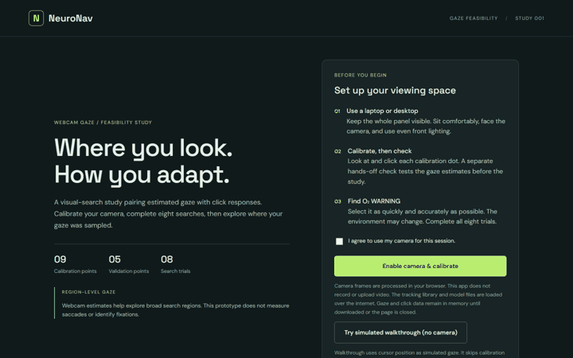

# NeuroNav

Spatial Adaptation Study 001 — an AI Accelerator research prototype.

NeuroNav explores how a learned target location affects visual search after the target moves. The current implementation combines an eight-trial spacecraft-panel task with webcam gaze estimation. The current UI requires camera calibration and a quality check before entering the experiment.

**Status:** functional prototype; webcam integration has not yet been validated with a live participant. A simulated cursor walkthrough is available without camera access. This is not a diagnostic tool. An optional saccade-candidate detector accepts synchronized recordings from suitable eye trackers; it does not analyze webcam estimates.



The walkthrough uses cursor position as **simulated data**, not eye tracking. Choose **Try simulated walkthrough (no camera)** on the start screen. It skips calibration so the task and results can be explored without a webcam. Simulated exports are labeled separately and must not be used as participant gaze data.

## Study flow

1. Read instructions and explicitly consent to camera use.
2. Enable the camera and position the face in its guide.
3. Calibrate at nine screen positions, clicking each point five times while looking at it.
4. Complete a separate five-point validation without clicking. Validation does not train the model.
5. Complete eight searches for **O₂ WARNING**.
6. Review click results and exploratory gaze summaries; download data.

| Trials | Environment | Target location |
| --- | --- | --- |
| 1–5 | A / Original | Upper-right |
| 6–8 | B / Changed | Lower-left |

The same deterministic 1200 × 680 control panel is rendered in both states; only the target indicator moves. The change is not announced during trials. Incorrect clicks are recorded without ending the trial. A successful click briefly displays “Target Found” before continuing. No gaze cursor, scores, or search hints appear during the task.

## Run locally

This is a static HTML/CSS/JavaScript application with no build step.

From the prototype directory, with Python installed:

```sh
python -m http.server 5186 --bind 127.0.0.1 --directory dist
```

Open http://127.0.0.1:5186 in a modern desktop browser. Use localhost or HTTPS for camera permission, a webcam, an internet connection for the external tracking library and model assets, and a viewport of at least 900 × 650 CSS pixels.

Syntax checks with Node.js:

```sh
node --check dist/app.js
node --check dist/gaze.js
```

## Source layout

| File | Responsibility |
| --- | --- |
| `dist/index.html` | Entry point and page metadata |
| `dist/style.css` | Layout, study screen, calibration, results |
| `dist/app.js` | Panel rendering, trial state, clicks, timing, CSV exports |
| `dist/gaze.js` | WebGazer adapter, consent, calibration, validation, gaze summaries, JSON export |
| `dist/saccades.js` | Optional eye-tracker CSV import and exploratory saccade-candidate analysis |
| `dist/icon.svg` | App icon |
| `vercel.json` | Serves `dist` as the Vercel site root |
| `AGENTS.md` | Guidance for future coding agents |

## Data and measurements

Click records contain session ID, trial and attempt numbers, start and click timestamps, reaction time, panel-relative coordinates, correctness, error count, target location, and environment state. Reaction time uses `performance.now()` near the rendered stimulus onset and ends at the correct pointer event. It is a browser estimate, not photodiode-verified display timing.

Webcam records include callback-arrival time relative to trial onset, viewport and panel coordinates, validity, region, and panel geometry. Trial summaries include first sampled region, first sample in the target quadrant, the upper-right share of on-panel samples, and valid predictions per second.

These are **gaze estimates and sample statistics**, not measured fixations, saccades, or dwell duration. Callback timestamps include inference latency. Valid callbacks do not establish coverage of all camera frames.

Available downloads:

- Trial CSV: the successful attempt for each completed trial.
- Click-log CSV: clicks and interrupted-attempt markers.
- Full-session JSON: gaze samples, validation samples and errors, region summaries, click events, and protocol metadata.
- Candidate CSV: optional imported high-rate eye-tracker saccade candidates after the eight trials.

## Optional eye-tracker saccade analysis

After the study, import a CSV with `trial,t_ms,x_px,y_px` columns and enter pixels per degree from the eye tracker's display calibration. Each timestamp must be synchronized to the corresponding trial's stimulus onset. The importer requires regular sampling at 120 Hz or higher and rejects gaps or duplicate timestamps. It applies a three-sample median filter and flags movements with velocity 30–1000°/s, duration 10–100 ms, and amplitude at least 1°. It reports candidate counts and first onset by trial and offers a CSV export.

This is an **exploratory velocity threshold**, not a validated detector. Review artifacts against the raw recording and a validated method such as REMoDNaV before scientific use. Do not import the sparse, delayed browser webcam predictions as if they were high-rate hardware data. The optional import is processed in browser memory; the uploaded recording is not sent to a server by this app.

Data is held in browser memory. The application does not upload or record camera video or participant data. WebGazer and its model assets are loaded from external services. Downloads are user initiated. Closing or reloading the page discards session data.

## Quality controls and limitations

- The prototype gate requires at least eight valid validation samples at each of five points and per-point median error no greater than 12% of viewport diagonal. This is an engineering feasibility threshold, not a validated scientific criterion.
- Automatic mouse-based training is disabled; calibration explicitly records the calibration-dot coordinates.
- Gaze prediction dots and camera feedback are hidden during trials.
- Hidden-page trial attempts restart and are flagged in the event log. Calibration/validation interruption or a changed window size requires a fresh session.
- The camera stops at completion, explicit cancellation, or page exit.
- WebGazer's MediaPipe face-mesh assets are loaded from a pinned CDN path. The previous relative path caused 404 responses and a `t is not a function` startup error on Vercel.
- There is no drift correction, fixation detector, hardware synchronization, or benchmark against a reference tracker. Saccade candidates require an external synchronized recording.
- Eight trials demonstrate the interaction and data flow. They do not establish learning effects, clinical validity, or statistical power.
- The remotely loaded WebGazer script is currently unpinned; its MediaPipe model asset path is pinned. Pin an audited WebGazer release and review its license and model dependencies before research deployment.
- Full live-camera end-to-end verification is outstanding. Existing checks cover JavaScript syntax and the base eight-trial click flow using simulated inputs; they do not validate gaze accuracy.

## Open-source eye-movement options

Research checked on September 29, 2026:

| Project | What it provides | Relevance to NeuroNav |
| --- | --- | --- |
| [REMoDNaV](https://github.com/psychoinformatics-de/remodnav) | MIT-licensed Python event detection for saccades, fixations, pursuit, and post-saccadic oscillations | Candidate offline detector for appropriate recorded gaze data. Requires dense regular sampling, known sampling rate, and pixel-to-visual-angle conversion. It does not capture camera data. |
| [OpenIris](https://github.com/ocular-motor-lab/OpenIris) | AGPL-3.0 Windows eye-tracking framework with camera plugins and a network interface | Candidate acquisition backend with compatible hardware. Its documented pipelines can exceed 500 Hz with suitable systems; this does not make a laptop webcam a high-speed tracker. |
| [OpenIrisDPI](https://github.com/ryan-ressmeyer/OpenIrisDPI) | GPL-3.0 dual-Purkinje-image plugin; documented 500 Hz tracking with appropriate optics | Research hardware route, not a drop-in webcam/browser library. |
| [PyGaze](https://github.com/esdalmaijer/PyGaze) | GPL-3.0 experiment toolbox with eye-tracker interfaces and saccade event methods | Candidate for a desktop experiment/hardware integration. |
| [WebGazer](https://webgazer.cs.brown.edu/) | Browser webcam gaze estimation, GPLv3 | Current feasibility adapter; no saccade claims are made. |
| [OcuTrace](https://mirket.io/ocutrace/) | Website advertises webcam saccade/antisaccade detection | Unverified dependency: the linked GitHub repository returned 404 during review. Do not rely on its performance claims without accessible code and validation. |

Recommended next research step: evaluate the optional detector against a validated method such as REMoDNaV and a reference dataset. Preserve raw data, device timestamps, stimulus events, coordinate transformations, missing intervals, and algorithm parameters. Do not upsample sparse webcam estimates and claim that this recovers unmeasured saccades.

## Deployment

Visit the live prototype at [neuronav-five.vercel.app](https://neuronav-five.vercel.app/). Vercel serves `dist` as the site root via `vercel.json`. Live camera accuracy and the full participant flow still need testing on a suitable device.

## Licensing

No project-wide license has been selected yet. Dependencies retain their own licenses; WebGazer is GPLv3. Review those obligations before redistribution or choosing a license for the combined application.

